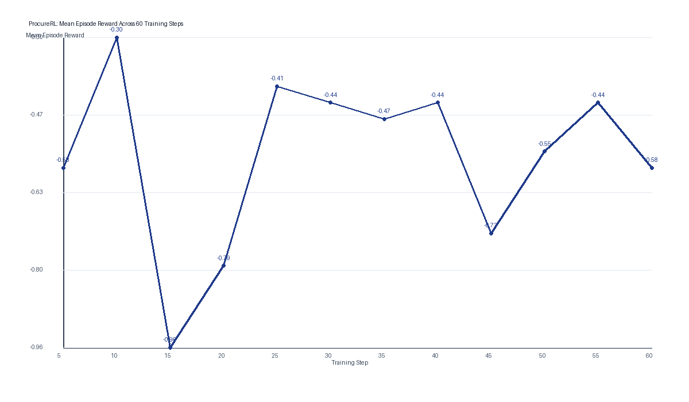
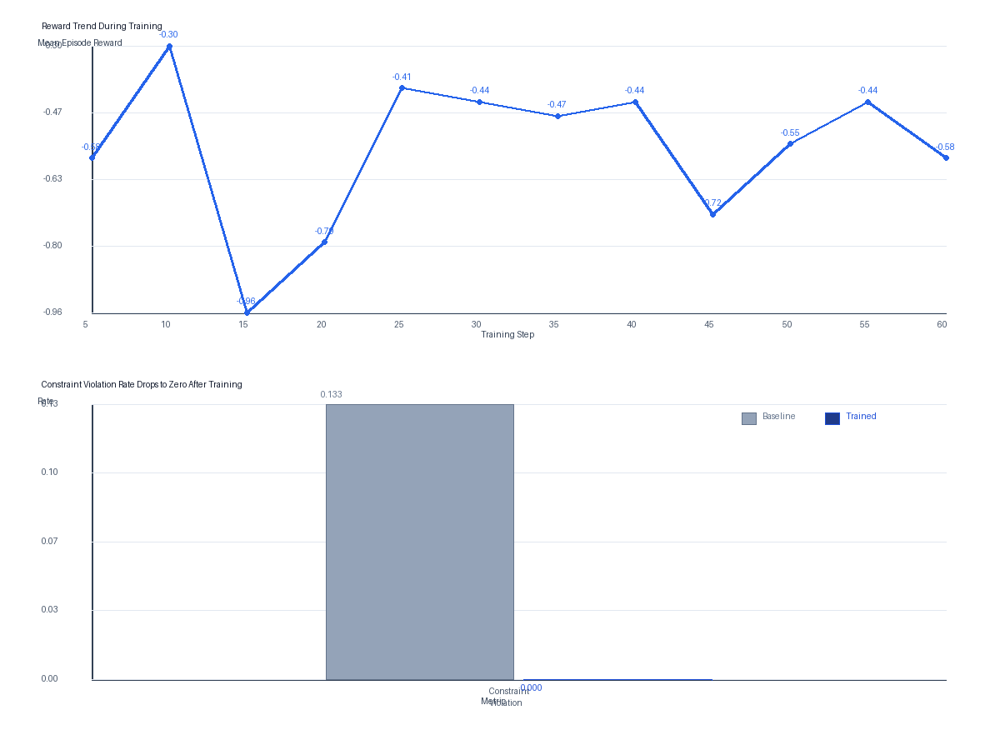
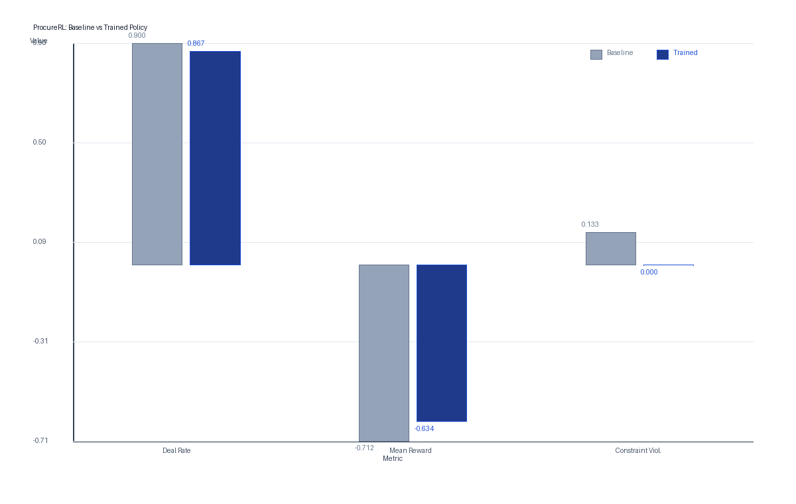

# ProcureRL - Procurement Negotiation RL Environment

[](https://huggingface.co/spaces/ShivenduShivu/ProcureRL)
[](https://github.com/meta-pytorch/OpenEnv)

## Meta OpenEnv Hackathon 2026 Submission

**[Live Environment on HuggingFace Spaces](https://huggingface.co/spaces/ShivenduShivu/ProcureRL)**

**[Demo Video (< 2 min)](https://youtube.com/YOUR_VIDEO_LINK)**

**[HuggingFace Blog Post](https://huggingface.co/blog/YOUR_POST)**

**[Training Notebook (Colab)](https://colab.research.google.com/github/ShivenduShivu/ProcureRL/blob/main/notebooks/ProcureRL_Training.ipynb)**

---

## 1. The Problem

LLMs can hold a conversation, but they fail at strategic negotiation.
In procurement, a negotiator must:

- Anchor strategically below the seller's opening price
- Use competitive pressure signals to create urgency
- Trade price against delivery time and quality tier
- Never exceed the procurement policy budget ceiling

No RL training environment existed for this. We built one.

The hard part is not just sounding persuasive. A useful procurement agent has to negotiate while respecting internal policy. It must avoid going over budget, react to market signals, and trade price against delivery and quality. That is exactly where generic LLM behavior often breaks down.

## 2. The Environment

**ProcureRL** is a multi-agent procurement negotiation environment built on
[AgenticPay](https://arxiv.org/pdf/2602.06008) and wrapped in OpenEnv-style interfaces.

| Feature | Description |
|---|---|
| Agents | Buyer (trained LLM) vs Seller (fixed scripted policy) |
| Variables | Price + delivery days + quality tier (3-dimensional) |
| Hidden info | Buyer's budget ceiling hidden from seller; seller's cost floor hidden from buyer |
| Market signal | Noisy estimate of true market price visible to buyer |
| Competitor signal | Optional competing supplier quote creates pressure |
| Constraint | Hard policy ceiling - exceeding it gives reward = -1.0 |
| Curriculum | Easy -> Medium -> Hard (price gap widens, rounds shrink) |

The training setup is intentionally asymmetric. The buyer agent is the policy we train. The seller is a scripted counterpart that provides a stable and reproducible negotiation partner. Each episode is a three-variable negotiation over price, delivery days, and quality tier.

## 3. Results

We train Qwen2.5-3B-Instruct using GRPO (TRL + Unsloth, 4-bit QLoRA).

| Metric | Baseline | Trained | Improvement |
|---|---|---|---|
| Deal Rate | 90.0% | 86.7% | -3.3% |
| Mean Reward | -0.7124 | -0.6340 | +0.0784 |
| Mean Savings | 0.1662 | 0.1521 | -0.0141 |
| Mean Rounds | 4.1 | 4.4 | +0.3 |
| Constraint Violations | 13.3% | 0.0% | -13.3% |

The strongest result is not raw deal count. The trained policy eliminates budget-ceiling violations entirely while improving mean episode reward. That means the buyer became more policy-compliant and safer under procurement constraints, even though it closed slightly fewer deals and accepted slightly lower savings on average.

### Reward Curves


*Mean episode reward across the canonical 60-step training run, showing how the training signal evolved over time.*


*Training reward trend paired with the key policy outcome: constraint violations drop from 13.3% at baseline to 0.0% after training.*


*Side-by-side comparison of the baseline and trained policies on deal rate, mean reward, and constraint violation rate.*

## 4. Why It Matters

Enterprise procurement represents trillions in annual spend globally.
An AI agent trained to negotiate strategically, use market data, and respect policy constraints has direct commercial value.
ProcureRL is a procurement-specific RL environment designed to make that training measurable and reproducible.

The core story is simple. First, generic LLMs struggle with policy-constrained negotiation. Second, ProcureRL gives us an environment where a buyer agent can train against a stable scripted seller across price, delivery, and quality. Third, the first training run already shows a meaningful safety improvement by removing budget violations and improving overall reward. Fourth, that matters because procurement is a trillion-dollar domain where unsafe negotiation behavior is expensive.

## Setup

```bash
pip install -r requirements.txt
pip install fastapi "uvicorn[standard]" pydantic
pip install -e .
```

```python
from agenticpay.openenv_adapter.procure_env_extended import ProcureEnvExtended

env = ProcureEnvExtended(difficulty="easy")
obs, info = env.reset()
obs, reward, terminated, truncated, info = env.step(
    "I can offer $108 for delivery within 18 days. <BUYER_PRICE>108</BUYER_PRICE>"
)
```

## API

Run the local server:

```bash
python -m uvicorn server.app:app --host 0.0.0.0 --port 7860
```

Example endpoints:

- `POST /reset`
- `POST /step`
- `GET /state/{session_id}`
- `GET /health`

## Themes

**Theme 1: Multi-Agent Interactions** - theory-of-mind reasoning, asymmetric information, competitive dynamics, emergent strategic behavior.

**Theme 3.1: World Modeling** - partially observable environment, persistent state, multi-step decision making under real procurement constraints.

## Citation

Built on AgenticPay: Liu et al. (2026) arXiv:2602.06008
